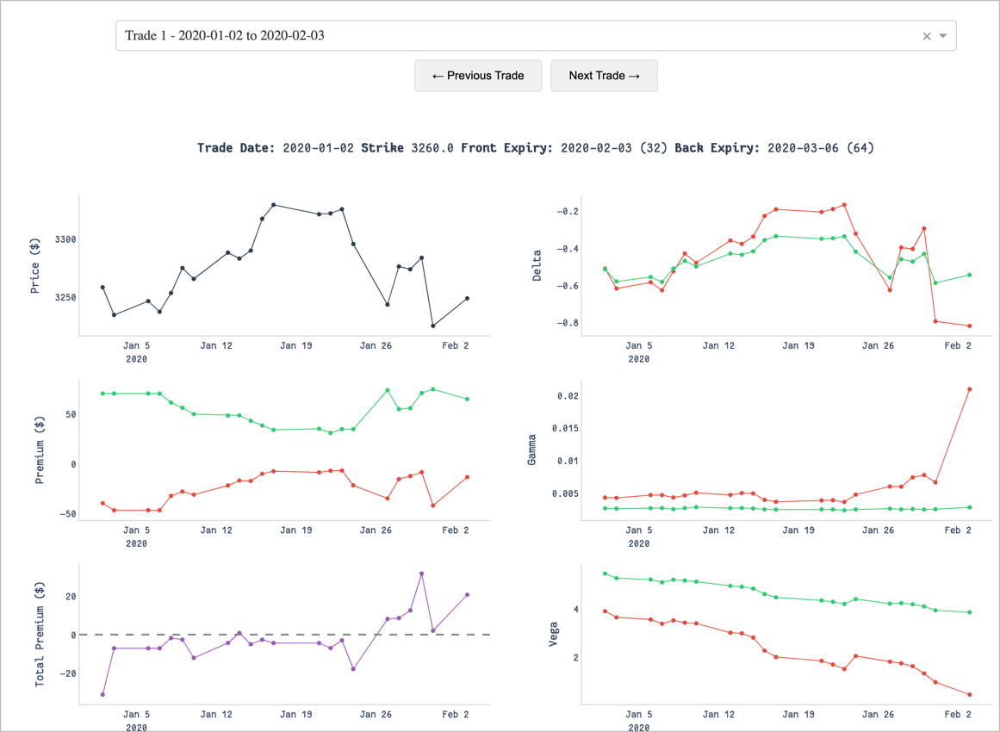

# Options Analysis Toolkit



## Reports

* [short-put-1-max-close-expiry.html](https://namuan.github.io/options-toolkit/short-put/short-put-1-max-close-expiry.html)

## Import Data

Extract all contents from compressed files into a designated folder.
The following script can read nested folders, allowing them to be accessed without being placed at the root level.

```shell
./src/optionsdx-data-importer.py --input $(pwd)/data/spx_eod --output data/spx_eod.db -v
```

Check for any missing data

```shell
./src/options-data-check-date-gaps.py --db-file data/spx_eod.db --days 5
```

## Strategies

### Naked Short Put

Filter: Between dates. 30 DTE
Trade every day, Close at Expiry

```shell
./src/options-short-put-simple.py --db-path data/spx_eod.db --dte 30 --start-date 2020-01-01 --end-date 2023-12-30 --max-open-trades 1 -v
```

Filter: 30 DTE
Trade every day, Close at Expiry

```shell
./src/options-short-put-simple.py --db-path data/spx_eod.db --dte 30 -v
```

Filter 7-60 DTE
Trade every day, Max 5 positions, Close at Expiry

```shell
for dte in {7..60}; do
    echo "Running for DTE: $dte"
    ./src/options-short-put-simple.py --db-path data/spx_eod.db --dte $dte --max-open-trades 1
done
```

```shell
./src/options-strategy-report.py --db-path data/spx_eod.db
```


### Long Put Calendar

Filter: Between dates. 30 DTE
Trade every day, Close at Expiry

```shell
./src/options-calendar-simple.py --db-path data/spx_eod.db --front-dte 30 --back-dte 60 --start-date 2020-01-01 --end-date 2020-03-30 --max-open-trades 1 -v
```

```shell
./src/options-calendar-trade-plotter.py --db-path data/spx_eod.db --front-dte 30 --back-dte 60
```

```shell
./src/options-strategy-report.py --db-path data/spx_eod.db
```
